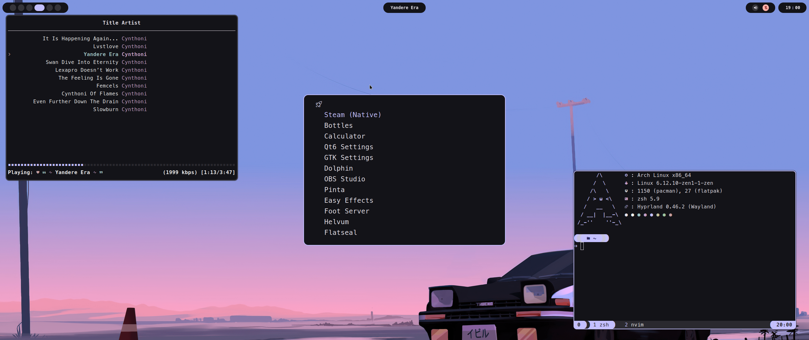
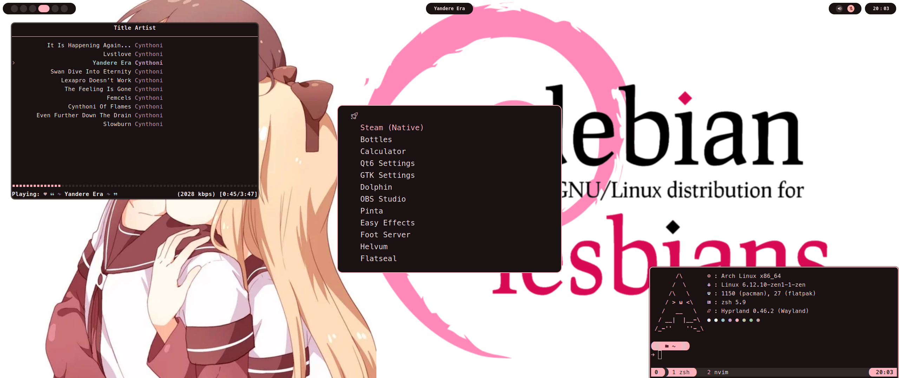

<div align="center">
<h1> Yet Another Material Hyprland Dotfiles </h1>
</div>

<div align="center">


</div>

<details>
<summary><h2>Programs I use</h2></summary>

- Window Manager - [Hyprland](https://github.com/hyprwm/Hyprland)
- Material Color Generation - [Matugen](https://github.com/InioX/matugen)
- Panel - [eww](https://github.com/elkowar/eww)
- Launcher - [tofi](https://github.com/philj56/tofi)
- Shell - [zsh](https://zsh.org)
- Prompt - [starship](https://github.com/starship/starship)
- Terminal - [foot](https://codeberg.org/dnkl/foot)
- File Manager - [lf](https://github.com/gokcehan/lf)
- IDE - [neovim](https://github.com/neovim/neovim)
- Browser - [librewolf](https://librewolf.net) + [Firefox gnome theme](https://github.com/rafaelmardojai/firefox-gnome-theme)
- Music Player - [kew](https://github.com/ravachol/kew)
- Wallpaper daemon - [swww](https://github.com/LGFae/swww)
- Wallpapers - [Here :3](https://github.com/EC2854/wallpapers)
- font - [Meslo LGL Nerd Font](https://github.com/ryanoasis/nerd-fonts/releases/download/v3.2.1/Meslo.zip)

</details>


## Laptops 
For battery and brightness indicators uncomment lines in:
- `.config/eww/variables.yuck`
- `.config/eww/tray.yuck`

*(Eww comments start with `;;` :3)*

## Screenshots
 
 

## Important Notes
- This setup uses [uwsm](https://github.com/Vladimir-csp/uwsm) to manage the Hyprland session. So make sure to start the session with **uwsm**.  Refer to the [Hyprland Wiki](https://wiki.hyprland.org/Useful-Utilities/Systemd-start/#launching-hyprland-with-uwsm) for more details.   
- I install GUI apps via **Flatpak**, so some configs/scripts expect Flatpak instead of native packages.

## Installation
> [!WARNING]
> Install script is untested so use at ur own risk

``` sh
git clone https://github.com/EC2854/Hyprland-Dots.git Dots && cd Dots && ./install.sh
```


## Thank You
- [flick0](https://github.com/flickowoa) for inspiration
- [SolDoesTech](https://github.com/SolDoesTech) for starting this all


<a href="https://star-history.com/#EC2854/Hyprland-Dots&Date">
    <picture>
        <source media="(prefers-color-scheme: dark)" srcset="https://api.star-history.com/svg?repos=EC2854/Hyprland-Dots&type=Date&theme=dark" />
        <source media="(prefers-color-scheme: light)" srcset="https://api.star-history.com/svg?repos=EC2854/Hyprland-Dots&type=Date" />
        
    </picture>
</a>

> If you like my work, You could gift me something from my [Bandcamp wishlist](https://bandcamp.com/ec2854/wishlist)

> Made with <3 by [Ewa (EC2854)](https://github.com/EC2854)
