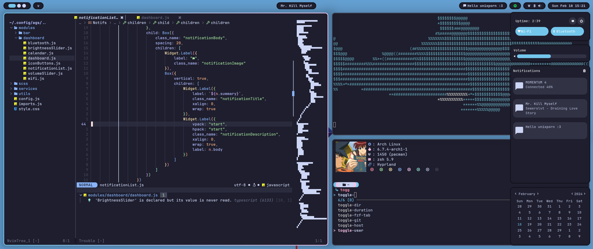
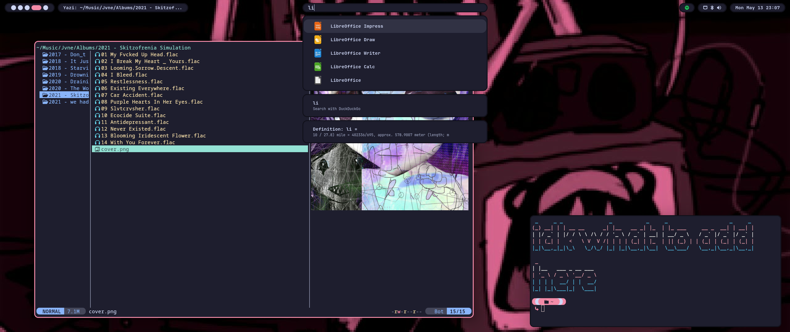
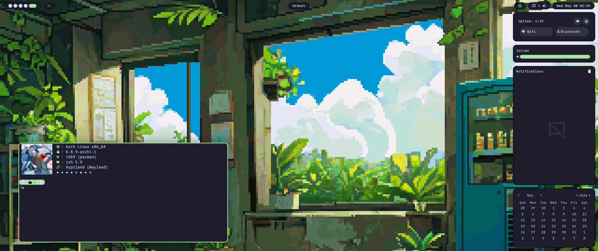

# Programs I use
- Window Manager - [Hyprland](https://github.com/hyprwm/Hyprland)
- Panel - [ags](https://github.com/Aylur/ags)
- Launcher - [anyrun](https://github.com/Kirottu/anyrun)
- Shell - [zsh](https://github.com/zsh-users/zsh)
- Prompt - [starship](https://github.com/starship/starship)
- Terminal - [foot](https://codeberg.org/dnkl/foot)
- File Manager - [yazi](https://github.com/sxyazi/yazi)
- IDE - [neovim](https://github.com/neovim/neovim)
- Browser - [floorp](https://github.com/Floorp-Projects/Floorp)
- Wallpapers - [swww](https://github.com/LGFae/swww)


# Laptops 
> [!WARNING]
> There is a ags config for laptops that adds battery indicator and brightness slider.
> to enable them uncomment lines in `./.config/ags/modules/bar/sysinfo/sysinfo.js`(line 16) and `./.config/ags/modules/dashboard/dashboard.js`(line 21)

# Terminal
To use dynamic accent color in terminal (prompt, fastfetch). u need to set config files to dynamic. U can use `chprompt`(alias for `~/.config/starship/changeprompt.sh`) to set both of them

# Screenshots
 





# Installation
idk if it will work. I will update install script later :3
``` sh
git clone https://github.com/EC2854/Hyprland-Dots.git Dots && cd Dots && ./install.sh
```

# SDDM
To install sddm theme copy `./sddm.conf` to `/etc` and `./catppuccin-minimal-sddm` to `/usr/share/sddm/themes`

# Thank You
- [flick0](https://github.com/flick0) for inspiration
- [SolDoesTech](https://github.com/SolDoesTech) for starting this all
- [Winter](https://github.com/exoess) for a base ags config

> Made with <3 by [Ewa (EC2854)](https://github.com/EC2854)
