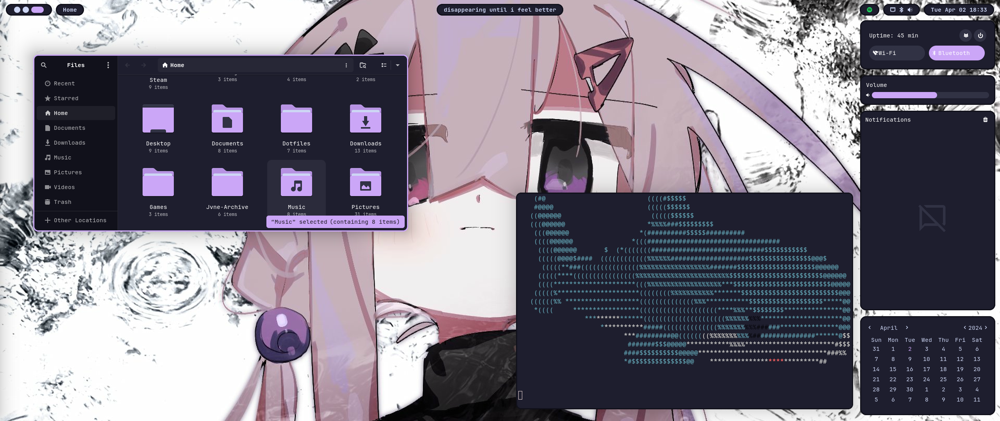

# Programs I use
- Window Manager - [https://github.com/hyprwm/Hyprland](Hyprland)
- Panel - [https://github.com/Aylur/ags](ags)
- Launcher - [https://github.com/Kirottu/anyrun](anyrun)
- Shell - [https://github.com/zsh-users/zsh](zsh)
- Prompt - [https://github.com/starship/starship](Starship)
- Terminal - [https://github.com/kovidgoyal/kitty](Kitty)
- File Manager - [https://github.com/sxyazi/yazi](yazi)
- IDE - [https://github.com/neovim/neovim](neovim)
- Browser - [https://github.com/Floorp-Projects/Floorp](floorp)
- Wallpapers - [https://github.com/LGFae/swww](swww)

# Screenshots
 


# Installation
idk if it will work. I will update install script later :3
``` sh
git clone https://github.com/EC2854/Hyprland-Dots.git Dots && cd Dots && ./install.sh
```

# Thank You
- [https://github.com/flick0](flick0) for inspiration
- [https://github.com/SolDoesTech](SolDoesTech) for starting this all
- [https://github.com/exoess](Winter) for a base ags config

> Made with <3 by [https://github.com/EC2854](EC2854)
